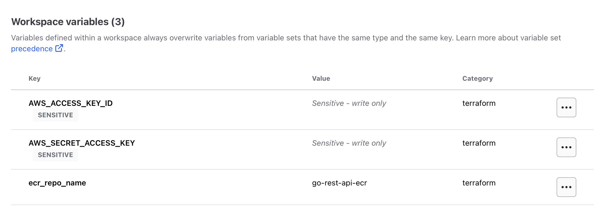

# Infrastructure Project
This repository contains code that sets up a Terraform-managed infrastructure comprising of an ECR, ECS, and RDS pivotal in deploying and managing a Go Restful API. 

# Infrastructure Overview
This project is designed with efficiency and scalability in mind.

- *ECS Cluster:* This the core of the infrastructure handling a service that manages numerous tasks. Each task encompasses a container dedicated to running the Go Restful API.
- *Load Balancer:* Ensures even distribution of incoming requests across tasks, optimizing response times and resource utilization.
- *PostgreSQL Database:* Provides robust data storage for the Go Restful API, ensuring data integrity and quick access.

# How to Deploy Infrastructure
*Makefile deprecated*
- In your terraform cloud account at acccessible at [app.terraform.io](https://app.terraform.io) create an organization and workspace see the following [documentation](https://developer.hashicorp.com/terraform/tutorials/cloud-get-started/cloud-sign-up) for more information.
- Navigate to Variables > Add variable. Add 3 workspace variables with the category, `environment` for AWS credentials environment variables, and `terraform` category for `ecr_repo_name`.
   - `AWS_ACCESS_KEY_ID` 
   - `AWS_SECRET_ACCESS_KEY`
   - `ecr_repo_name`

    These workspaces variables are required for the `terraform.yml` workflow to run.
    

- Manually trigger `deploy.yaml` workflow or tag commit with version format `v*.*.*`,to create build artifact to be used by ECS.
- When done Queue destroy plan. On terraform cloud, navigate **Projects & Workspaces** > *[YOUR WORKSPACE]* > **Settings** > **Destruction and Deletion** > **Manually destroy**
    

## Author
- Joseph Eshiett - [Github](https://github.com/eshiettjoseph)

## Collaborators
- [YOUR NAME HERE] - Feel free to contribute to the codebase by resolving any open issues, refactoring, adding new features, writing test cases or any other way to make the project better and helpful to the community. Feel free to fork and send pull requests.

## Hire me
Looking for a DevOps Engineer to build your next infrastructure? Get in touch: [josepheshiett@gmail.com](mailto:josepheshiett@gmail.com)
